<!-- 1. DESTAQUE NA CAPA: Gráfico de Contribuições Animado (Onda) -->
<h3><code>nic@github ~ $ ./contributions.sh</code></h3>

  

<!-- 2. FOTO DESENHADA E DESCRIÇÕES (NEOFETCH) -->
<h3><code>nic@github ~ $ whoami</code></h3>
<table>
  <tr>
    <td valign="top">
      
    </td>
    <td valign="top">
      
    </td>
  </tr>
</table>

  

<!-- 3. CERTIFICAÇÃO CISCO -->
<h3><code>nic@github ~ $ cat certificacoes/cisco.txt</code></h3>

  

<!-- 4. TECNOLOGIAS E FERRAMENTAS -->
<h3><code>nic@github ~ $ ls ~/stack</code></h3>

  
  
  
  
  
  
  
  
  
  

